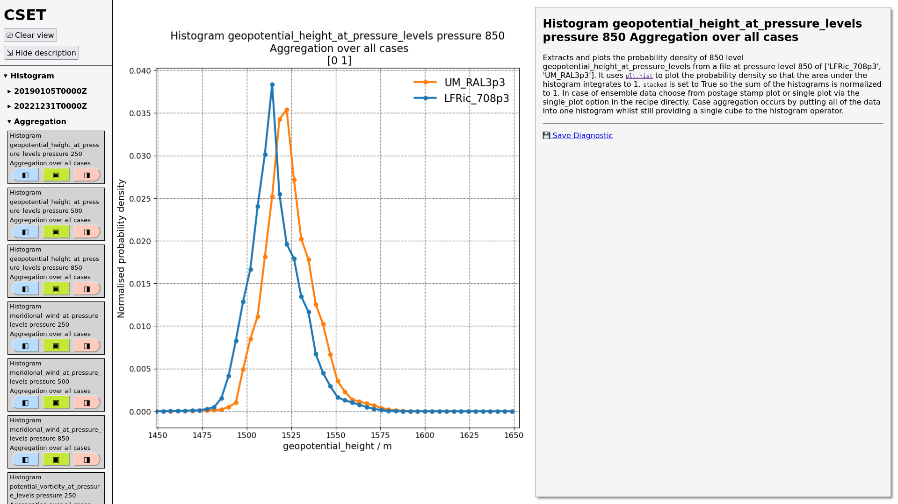

<!-- TODO: Get people's agreement on authorship, and their preferred names and ORCIDs. -->

# Summary

<!-- A summary describing the high-level functionality and purpose of the software for a diverse, non-specialist audience. -->

The _Convective- [and turbulence-] Scale Evaluation Toolkit_ (**CSET**) is a community-driven open source library, command line tool, and workflow designed to support the evaluation of weather and climate models at convective and turbulent scales.
Developed by the Met Office in collaboration with the [Momentum® Partnership][momentum_partnership] and broader research community, CSET provides a reproducible, modular, and extensible framework for model diagnostics and verification.
It analyses numerical weather prediction (NWP) and climate modelling output, including from the next-generation LFRic model [@lfric], ML models, and observational data and visualises the output in an easily sharable static website to allow the development of a coherent evaluation story for weather and climate models across time and spatial scales.

# Statement of need

<!-- A Statement of need section that clearly illustrates the research purpose of the software and places it in the context of related work. -->

Evaluation is essential for the model development process in atmospheric sciences.
Typically, an evaluation includes both context and justification to demonstrate the benefit of model changes against other models or previous model versions.
The verification provides the context or baseline for understanding the model’s performance through comparison against observation.
The evaluation then demonstrates the benefit through comparison against theoretical expectations or previous or different version of the model and other models for similar application areas using diagnostics derived from model output to explain the context.

# Contribution to the field

CSET addresses the need for an evaluation system that supports consistent and comparable evaluation.
It gives users easy access to a wide selection of peer-reviewed diagnostics, including spatial plots, time series, vertical profiles, probability density functions, and aggregated analysis over multiple model simulations, replacing bespoke evaluation scripts.
To cater for the full evaluation process, CSET provides a range of verification diagnostics to compare against observations and derived diagnostics based on model output, allowing for both physical process-based and impact-based understanding.

<!-- TODO: Find a better image. -->

<!-- TODO: Should METplus be mentioned given it isn't integrated yet? -->
The verification side of CSET utilises the Model Evaluation Tools (METplus) verification system [@metplus] to provide a range of verification metrics that are aligned with operational verification best practices.
The justification side of CSET consists of a range of diagnostics derived from model output.
These derived diagnostics include process-based diagnostics for specific atmospheric phenomena and impact-based diagnostics that can be used to understand how model changes will affect customers.

## Design

CSET is build using operators, recipes and a workflow:

* **Operators** are small python functions performing a single task, such as reading, writing, filtering, executing a calculation, stratifying, or plotting.
* **Recipes** are YAML files that compose operators together to produce diagnostics, such as a wind speed difference plot between two model configurations.
* The **Workflow** runs the recipes across a larger number of models, variables, model domains and dates, collating the result into a website.

The design provides a flexible software that is easily adaptable by scientists to address model evaluation questions while maintaining traceability.

The recipes and operators within CSET are well-documented, tested, and peer reviewed, increasing discoverability and giving confidence to users.
The documentation covers information on the applicability and interpretation of diagnostics, ensuring they are appropriately used.

CSET has been built with portability in mind.
It can run on a range of platforms, from laptops to supercomputers, and can be easily installed from conda-forge.
It is built on a modern software stack that is underpinned by Cylc (a workflow engine for complex computational tasks) [@cylc8], Python 3, and Iris (a Python library for meteorological data analysis) [@scitools_iris].
CSET is open source under the Apache-2.0 licence, and actively developed on GitHub, with extensive automatic unit and integration testing.
It aims to be a community-based toolkit, thus contributing to CSET is made easy and actively encouraged with clear developer guidelines to help.

# Research usage

<!-- Mention (if applicable) a representative set of past or ongoing research projects using the software and recent scholarly publications enabled by it. -->

Recently, CSET has been the tool of choice in the development and evaluation of the Regional Atmosphere Land Configuration RAL3-LFRic in the Met Office and across the Momentum® Partnership (a cooperative partnership of institutions sharing a seamless modelling framework for weather and climate science and services), as part of the Met Office’s Next Generation Modelling System (NGMS) programme to transition from the Unified Model to LFRic.
It has helped us to characterise the regional configuration and lead to improvements in our model.

# Conclusion

CSET shows the benefits of open source evaluation software.
It reduces redundant evaluation diagnostics development and supports easier collaboration across organisations involved in atmospheric model evaluation, helping to build a clear and consistent understanding of model characteristics and model improvement benefits.
Major items on CSET's development roadmap are integrating METplus verification into the workflow, and increasing the number of supported observation sources.

The CSET documentation is hosted at https://metoffice.github.io/CSET

# Acknowledgements

<!-- Acknowledgement of any financial support. -->

We acknowledge contributions and support from the Met Office and Momentum® Partnership for this project.

# References

<!-- A list of key references, including to other software addressing related needs. Note that the references should include full names of venues, e.g., journals and conferences, not abbreviations only understood in the context of a specific discipline. -->

[momentum_partnership]: https://www.metoffice.gov.uk/research/approach/collaboration/momentum-partnership
