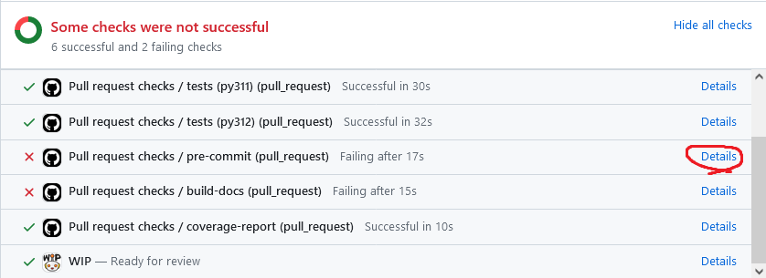

Developer's Guide
=================

To aid in the development of CSET we are adopting some working practices so
everyone involved knows what to expect. Linked from this page is everything you
need to get started, and the links below go into more detail on specific topics.

.. toctree::
    :maxdepth: 1

    getting-started
    git
    testing
    documentation
    code-review
    releases

Contributing checklist
----------------------

If you have just opened a pull request (PR), then these are the things you need
to do ahead of a :doc:`code review <code-review>`.

Documentation has been updated to reflect change
~~~~~~~~~~~~~~~~~~~~~~~~~~~~~~~~~~~~~~~~~~~~~~~~

If you've added a new function check whether it has been documented? If you
changed the name of a setting have you changed it everywhere in the
documentation?

New code has tests, and affected old tests have been updated
~~~~~~~~~~~~~~~~~~~~~~~~~~~~~~~~~~~~~~~~~~~~~~~~~~~~~~~~~~~~

A comment should be automatically posted on your PR showing how much of your
code is tested. Try and keep this as high as possible by adding new tests when
you add new code. Also, make sure the tests are actually testing a reasonable
range of different uses. For more, see :doc:`testing`.

All tests and CI lints pass
~~~~~~~~~~~~~~~~~~~~~~~~~~~

All of the pre-existing tests should pass, as should the formatting and linting
checks. If they are not, click on "Details" next to the failing check and it
will show you what failed. Some of the errors are auto-corrected. In that case
you need to add the file again with git add and rerun the commit.

Ensured the pull request title is descriptive
~~~~~~~~~~~~~~~~~~~~~~~~~~~~~~~~~~~~~~~~~~~~~

The title of a pull request should clearly describe what the pull request
changes, and in particular should highlight any breaking changes.

The titles of pull requests are used to compile the release notes and
:doc:`/changelog`, therefore it is important that they are easy to understand
for people who are not familiar with the code. Descriptive pull request titles
also makes it easier to search for changes; useful when a bug was introduced.

The pull request title can be edited by clicking the "Edit" button to its right.
If you need more text to describe what the pull request does, please add it in
the description.

Conda lock files have been updated if dependencies changed
~~~~~~~~~~~~~~~~~~~~~~~~~~~~~~~~~~~~~~~~~~~~~~~~~~~~~~~~~~

If you have changed the dependencies of CSET you will need to regenerate the
conda dependency lock files. This can be done by running the `update conda lock
files workflow`_ from your branch, then merging the PR it creates into your own
branch. (Not the default ``main`` branch!)

.. _update conda lock files workflow: https://github.com/MetOffice/CSET/actions/workflows/conda-lock.yml

Attributed any Generative AI, such as GitHub Copilot, used in this PR
~~~~~~~~~~~~~~~~~~~~~~~~~~~~~~~~~~~~~~~~~~~~~~~~~~~~~~~~~~~~~~~~~~~~~

Generative AI tools such as GitHub Copilot are useful, but there are still
unanswered questions around the copyright of their output. Therefore CSET
contributions that used Generative AI must disclose it, along with the name of
the AI tool used. This can be a simple statement in the PR description, for
example:

.. code-block:: text

    This PR contains AI generated code from GitHub Copilot.

Marked the PR as ready to review
~~~~~~~~~~~~~~~~~~~~~~~~~~~~~~~~

If you opened the PR as a draft make sure it is marked as ready for review with
a green status symbol when it is ready for others to look at it.
