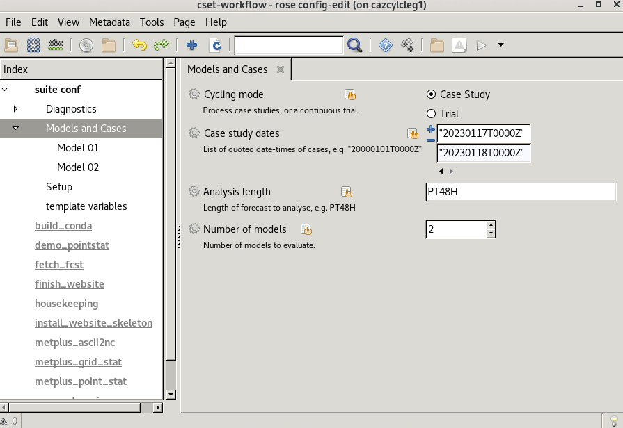
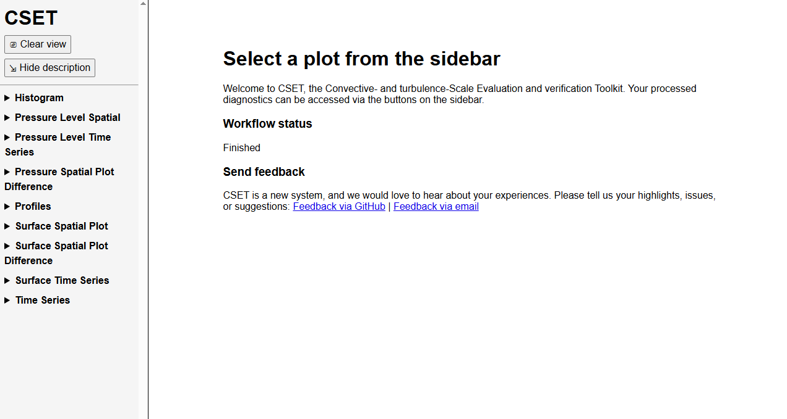
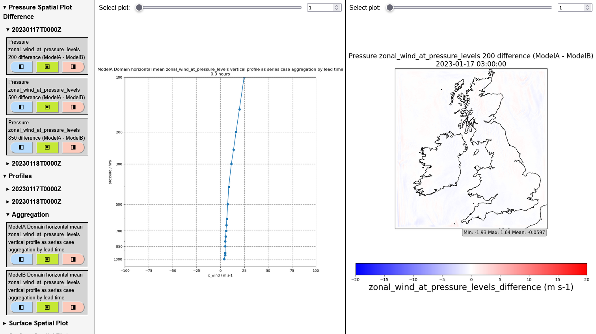

Running a full CYLC workflow with CSET v25.3.1
==============================================

.. Tutorial on running CSET within a CYLC environment.

This tutorial provides a step by step guide of how to run CSET within
a CYLC environment across multiple forecast data that will populate a
website with the plots to navigate. This guide assumes that you have
`Cylc 8`_ installed in your workspace. You can confirm this by typing

.. code-block:: bash

   cylc --version

Which should produce a version 8.X.

1. Download CSET workflow
-------------------------

The next step is to download the latest release of CSET, which can be
found at `CSET Releases`_. This example will utilise version **v25.3.1**.
Once you have downloaded the tar.gz, untar the file.

If you are running in the Met Office or the Momentum Partnership, you can then
cd into the ``cset-workflow-v25.3.1`` folder, and run ./install_restricted_files.sh.
This adds some site specific configuration files that specify where CYLC will
run the tasks. For other users, you can skip this step and use the localhost site
instead.

2. Download CSET sample data
----------------------------

We will now download some sample data, which will contain screen air temperature
and air temperature on pressure levels for a couple of forecasts, for two different
models to help us explore some of the functionality of CSET. The data consists of
4 files to download;

=========================== ======= ======================================
File                        Size    SHA256 checksum
=========================== ======= ======================================
`MODELA_20230117T0000Z.nc`_ ~20 MiB ``669a6e31c10ad0a9ebd62fd19770f99775afc89f167b16ecb27e0e4b48160c19``
`MODELA_20230118T0000Z.nc`_ ~20 MiB ``9a9829ac8a130f9698f02b4cb09f6c1ceda8ce8192ba1cda3b7cbac731e8a7c0``
`MODELB_20230117T0000Z.nc`_ ~90 MiB ``64a91273afa6ffa496d9cbd478eb486d84a51e05be98f4864398ea5af8df2e9d``
`MODELB_20230118T0000Z.nc`_ ~90 MiB ``d2a476f61e58da6120a4658324b259ecb827847250cc8841104dfd1135a6f300``
=========================== ======= ======================================

You can directly copy these links and use ``wget`` to retrieve, or download in your
browser.

3. Configuration
----------------

Now we have the CSET release and the files we want to visualise, we first copy the
`rose-suite.conf.example` to `rose-suite.conf`. We can then begin to start setting up
the configuration using ``rose edit`` command inside the ``cset-workflow-v25.3.1``
directory.

i. Diagnostics
~~~~~~~~~~~~~~

Expand the options in Diagnostics; we will ignore the sections Convection, Other
and Verification blank for now, but this is where various diagnostics can be toggled
on/off. For now, we will go to Quicklook, and add ``"temperature_at_screen_level"`` to the
Surface model fields list. We will then toggle all the options below to True, apart from
any case aggregation tasks over validity time or hour of day, until we get to
``SURFACE_SINGLE_PONT_TIME_SERIES`` which we will leave blank.

We will next add
``"zonal_wind_at_pressure_levels"`` to the Pressure level model fields list, and choose
some pressure levels to plot. Lets plot ``200``, ``500`` and ``850``. Again, toggle all
the options below this to True apart from case aggregation tasks over validity time or hour of day
until we get to ``EXTRACT_PLEVEL_TRANSECT`` which we will keep to False. Ignore any options
below this, they are for transects and plotting on model levels.

ii. Data
~~~~~~~~

We will next click on Models and Cases in the left hand column, and add the case study dates
for our forecasts. These are ``"20230117T0000Z"`` and ``"20230118T0000Z"``. Set the Analysis length
PT48H, and select number models to be 2. Once this is done, you should be able to expand the
Models and Cases menu on the left hand side to reveal Model 01 and Model 02.

For each model respectively, fill in either ModelA and ModelB in the model name, select
Filesystem retrieval, and enter the path to the data. This should follow the format
``/some/path/to/data/MODELA_%Y%m%dT%H%MZ.nc``, where you replace ModelA with the relevant
model. The ``%`` will evaluate the path base on the case study date.

iii. Site setup
~~~~~~~~~~~~~~~

Finally, we will go to Setup, and select your organisation from the Site list, or localhost if it is not listed. Add website
details for where to display the plots at, this will differ depending on what organistation
you are running CSET from. You can use the GUI help by clicking on the cog icon next to
each variable, which will provide more information on how to fill this in. Make sure you save
the configuration before closing ``rose edit``.

4. Run workflow
---------------

We are now ready to run CSET! Within the cset-workflow folder, run ``cylc vip .``. You can
monitor the progress by using either ``cylc tui`` on the command line, or ``cylc gui``, which
will open up a browser showing progress through the workflow.

5. View webpage
---------------

Once completed, you will get an email and be able to look through plots at the web address
you specified in the GUI. The GUI on the website will look like the below image. You can navigate
through the drop down menu items on the left hand side. Note that the plots are stored in the
``web`` folder, located in ``~/cylc-run/cset-workflow/runN/share/web`` for the latest CSET run.
If you clean the suite, it will delete the plots. To keep the plots safe, move the web folder
to a sensible location, and symlink the web folder back to the page where you have been displaying
the plots (the path in Web Directory in the rose edit GUI).

.. _Cylc 8: https://cylc.github.io/cylc-doc/stable/html/index.html
.. _CSET Releases: https://github.com/MetOffice/CSET/releases
.. _MODELA_20230117T0000Z.nc: https://github.com/jwarner8/MO_Github_External/raw/refs/heads/master/CSET_exampledata/MODELA_20230117T0000Z.nc
.. _MODELA_20230118T0000Z.nc: https://github.com/jwarner8/MO_Github_External/raw/refs/heads/master/CSET_exampledata/MODELA_20230118T0000Z.nc
.. _MODELB_20230117T0000Z.nc: https://github.com/jwarner8/MO_Github_External/raw/refs/heads/master/CSET_exampledata/MODELB_20230117T0000Z.nc
.. _MODELB_20230118T0000Z.nc: https://github.com/jwarner8/MO_Github_External/raw/refs/heads/master/CSET_exampledata/MODELB_20230118T0000Z.nc
