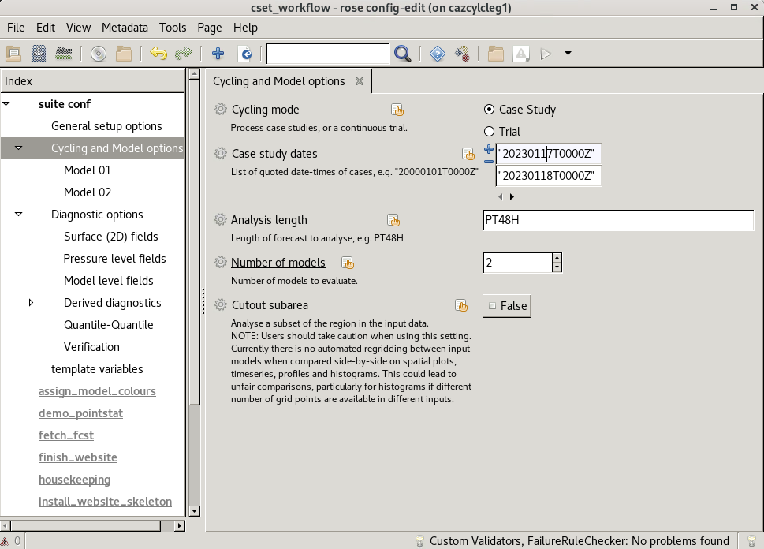
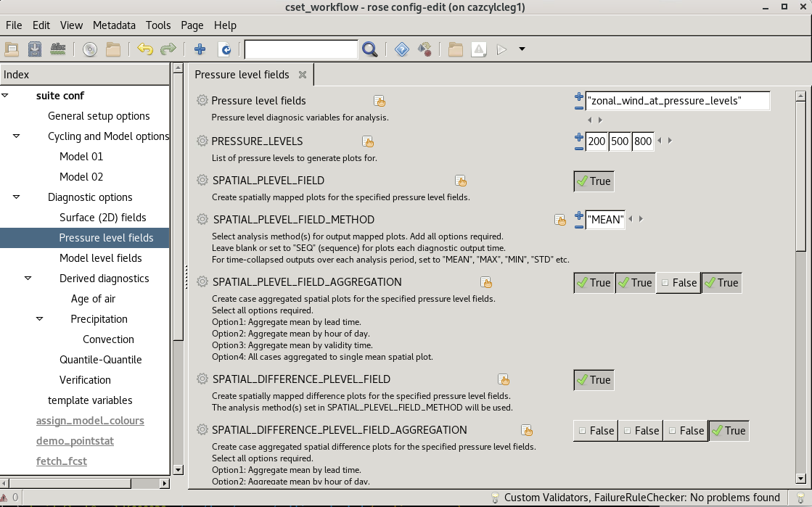
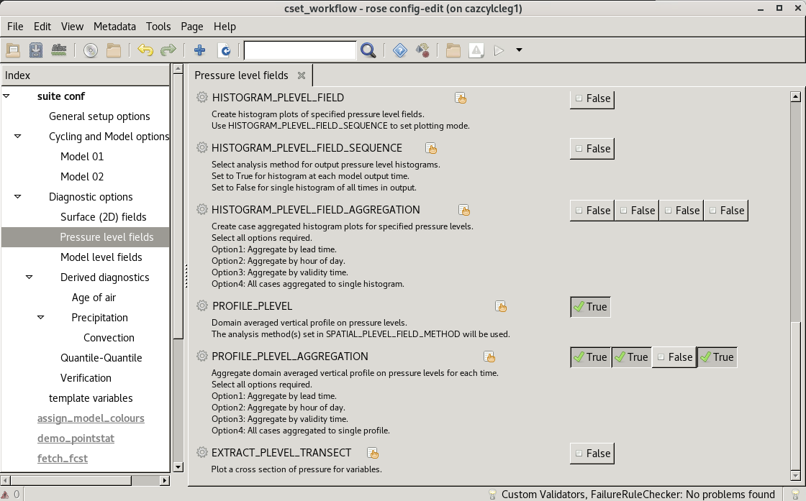

Running a full CYLC workflow with CSET v25.3.1
==============================================

.. Tutorial on running CSET within a CYLC environment.

This tutorial provides a step by step guide of how to run CSET within
a CYLC environment across multiple forecast data that will populate a
website with the plots to navigate. This guide assumes that you have
`Cylc 8`_ installed in your workspace. You can confirm this by typing

.. code-block:: bash

   cylc --version

Which should produce a version 8.X.

1. Download CSET workflow
-------------------------

Next download the latest release of CSET, which can be
found at `CSET Releases`_. This example will utilise version **v25.3.1**.
Once you have downloaded the tar.gz file, untar the file.

.. code-block:: bash

   tar -xvf cset-workflow-v25.3.1.tar.gz

If you are running in the Met Office or the Momentum Partnership, you can then
navigate into the ``cset-workflow-v25.3.1`` folder, and run the
``install_restricted_files.sh`` script.

.. code-block:: bash

   cd cset-workflow-v25.3.1
   ./install_restricted_files.sh

This adds some site specific configuration files that specify where cylc will
run the tasks. For other users, you can skip this step and use the localhost
site instead.

2. Download CSET sample data
----------------------------

We will now download some sample data, which will contain screen air temperature
and air temperature on pressure levels for two sample forecasts, for two
different models to help us explore some of the functionality of CSET. The
tutorial data consists of 4 files to download;

=========================== ======= ======================================
File                        Size    SHA256 checksum
=========================== ======= ======================================
`MODELA_20230117T0000Z.nc`_ ~20 MiB ``669a6e31c10ad0a9ebd62fd19770f99775afc89f167b16ecb27e0e4b48160c19``
`MODELA_20230118T0000Z.nc`_ ~20 MiB ``9a9829ac8a130f9698f02b4cb09f6c1ceda8ce8192ba1cda3b7cbac731e8a7c0``
`MODELB_20230117T0000Z.nc`_ ~90 MiB ``64a91273afa6ffa496d9cbd478eb486d84a51e05be98f4864398ea5af8df2e9d``
`MODELB_20230118T0000Z.nc`_ ~90 MiB ``d2a476f61e58da6120a4658324b259ecb827847250cc8841104dfd1135a6f300``
=========================== ======= ======================================

You can directly copy these links and use ``wget`` to retrieve, or download in your
browser.

3. Workflow configuration
-------------------------

After downloading the CSET release and the data to evaluate, we next set up the
required configuration. The `rose-suite.conf.example` file is a starting point
to copy to create a `rose-suite.conf` configuration file, which can be edited
using the ``rose edit`` command inside the ``cset-workflow-v25.3.1`` directory.

.. code-block:: bash

   cd cset-workflow-v25.3.1
   cp rose-suite.conf.example rose-suite.conf
   rose edit

GUI help can be accessed by clicking the cog icon next to each rose GUI option, which provides more information on
potential settings.

a) General setup options
~~~~~~~~~~~~~~~~~~~~~~~~

Expand the options tab under the top level ``suite conf`` index heading and go to the ``General setup options`` panel.

* Select the ``Site`` or set ``Localhost`` if not listed.
* Add website details for where CSET outputs will be displayed. This will differ
  depending on the location from which CSET is run, and details of available web
  servers.

.. image:: rose-edit.png
    :alt: Screenshot of the CSET GUI.

b) Cycling and Model options
~~~~~~~~~~~~~~~~~~~~~~~~~~~~

Next select the ``Cycling and Model options`` panel in the left hand index.

* Leave the ``Cycling mode`` selected as ``Case Study`` for this 2 forecast example.
* Add the 2 required ``Case study dates`` to evaluate. These are forecasts initialised on
  ``"20230117T0000Z"`` and ``"20230118T0000Z"`` for this tutorial.
* Set the ``Analysis length`` as ``PT48H`` to indicate a 48-hour forecast length.
* Select the ``Number of models`` to evaluate. In this tutorial, we want to assess 2 different models.

Setting the number of models activates new ``Model 01``, ``Model 02``, ...
panels in the index in which to specify model-relevant options.

Navigate to each Model panel in turn to provide model-specific settings:

* Add a readable ``Model name`` which will be associated with the data in CSET outputs.
* Select ``Filesystem`` as the ``Data source`` to indicate that the test data are on local disk.
* Enter the path to data, including wildcards and formatting to specify filename structure. This
  should follow the format ``/some/path/to/data/MODELA_%Y%m%dT%H%MZ.nc``, or similar to provide
  a unique path to required data files. The ``%`` components in the file path will evaluate the
  filename based on the case study date.

c) Diagnostic options
~~~~~~~~~~~~~~~~~~~~~

Next expand the ``Diagnostic options`` panel. To illustrate the plotting options
we first focus on an example of evaluating ``Surface (2D) fields``. This
provides support for variables that are only defined on a single diagnostic
level. Standard options for variables defined on multiple levels (e.g. pressure
levels or vertical model levels) are similar, and editable on the relevant
sub-panel selected from the left hand index.

* Select the ``Surface (2D) fields`` panel.
* Click the ``+`` option to add a variable name to ``Surface (2D) fields`` and
  add ``"temperature_at_screen_level"`` as a new variable to evaluate. Note the
  list of fields can be extended to capture all variables of interest from input
  data within the same CSET workflow run.
* Set ``SPATIAL_SURFACE_FIELD`` to ``True`` to enable plotting of spatial maps.
* Add any ``SPATIAL_SURFACE_FIELD_METHOD`` options required to set the mode for
  spatial map plotting. For example, adding ``SEQ`` method will produce a series
  of output maps for every diagnostic time through the forecast (e.g. hourly).
  Adding a ``MEAN`` method will activate production of forecast-mean diagnostic
  map plots. A number of methods can be specified in this list to generate all
  within the same CSET workflow run.
* Set any required ``SPATIAL_SURFACE_FIELD_AGGREGATION`` options. This selects
  any methods for generating aggregated summary maps computed as a function of
  lead time, hour of day, validity time, or to generate a single map summarising
  all input data across all forecast periods.
* Set ``SPATIAL_DIFFERENCE_SURFACE_FIELD`` to activate difference map plots
  comparing ModelA to Model B, and then set required
  ``SPATIAL_DIFFERENCE_SURFACE_FIELD_AGGREGATION`` options for aggregating
  differences across multiple cases.
* Scroll further down in the Surface (2D) fields panel to show other plot type
  methods and options.
* Set ``TIMESERIES_SURFACE_FIELD`` and select associated ``AGGREGATION`` options
  to enable domain mean (or sub-area) time series plots.
* Set ``HISTOGRAM_SURFACE_FIELD`` to create histogram plots of surface field
  diagnostics. Leave ``HISTOGRAM_SURFACE_FIELD_SEQUENCE`` as ``False`` to
  generate a single histogram from all data in the forecast, or set to ``True``
  to output a new histogram for each output time. Set associated ``AGGREGATION``
  options to control plotting of aggregated outputs across forecasts.
* Use ``SURFACE_SINGLE_POINT_TIME_SERIES`` to request a time series plot of
  outputs at a user-selected location.

.. image:: cset_uiD.png
    :alt: Screenshot of the CSET GUI for Surface 2D fields options - lower.

Next to add a 3D variable of interest, use the ``Pressure level fields`` panel.

* Add ``"zonal_wind_at_pressure_levels"`` to the list of ``Pressure level fields``.
* Add some pressure levels on which to generate outputs - for example by adding
  ``200``, ``500`` and ``850`` to the list of ``PRESSURE_LEVELS``.
* To generate spatial plots of the zonal wind on each selected pressure level,
  enable ``SPATIAL_PLEVEL_FIELD`` to ``True``.
* Assume we also wish to generate ``SPATIAL_DIFFERENCE_PLEVEL_FIELD`` plots of
  mapped differences but only aggregation to a single output across all
  forecasts.
* Assume we do not require ``TIMESERIES_PLEVEL_FIELD`` or
  ``HISTOGRAM_PLEVEL_FIELD`` outputs, so leave these settings as ``False``.
* To activate vertical profile plots, select ``PROFILE_PLEVEL`` at ``True``, and
  select all required ``AGGREGATION`` options to control the collation of
  profile results across forecasts. Note this will only generate profiles from
  the ``PRESSURE_LEVELS`` selected (i.e. data at 200 hPa, 500 hPa and 850 hPa in
  this example), so ensure the number of requested levels is sufficiently high
  to generate the required vertical resolution outputs.
* Options for plotting vertical pressure level transects are activated using
  ``EXTRACT_PLEVEL_TRANSECT``.

Requested variables defined as ``Model level fields`` on vertical model levels
can be selected using the next panel, with options mirroring those provided for
``Pressure level fields`` described above.

Details for any of the available settings for ``Process-based`` methods and
``Verification`` can be found using the rose GUI help.

Ensure to save the configuration before closing ``rose edit``.

4. Run workflow
---------------

We are now ready to run CSET!

* Within the cset-workflow folder, run ``cylc vip .``.
* Monitor the progress by using either ``cylc tui`` on the command line, or
  ``cylc gui``, which will open up a browser showing progress through the
  workflow.

.. code-block:: bash

   cylc vip .
   cylc gui

5. View CSET outputs
--------------------

Once completed, the CSET workflow will send an email to confirm successful completion and link to
outputs at the web address specified in the GUI.

Outputs are stored in the ``web`` folder, located in ``~/cylc-run/cset-workflow/runN/share/web``
(or an equivalent ``cylc-run`` path if running the CSET workflow with a specified run name).

.. warning::

    If you ``cylc clean`` the workflow, this will delete the plot directory. To
    keep the plots independently of the workflow directory, move the web folder
    to a required alternative location and update the symlink to the ``web``
    folder back to the ``Web directory`` location from which CSET outputs are
    displayed.

.. image:: cset_web1.png
    :alt: Screenshot of the CSET web interface.

CSET web outputs can be navigated using the index organised by type of plot, and by forecast date
and aggregations. Plots can be displayed in either left-hand, central, or right-hand web views.

.. _Cylc 8: https://cylc.github.io/cylc-doc/stable/html/index.html
.. _CSET Releases: https://github.com/MetOffice/CSET/releases
.. _MODELA_20230117T0000Z.nc: https://github.com/jwarner8/MO_Github_External/raw/refs/heads/master/CSET_exampledata/MODELA_20230117T0000Z.nc
.. _MODELA_20230118T0000Z.nc: https://github.com/jwarner8/MO_Github_External/raw/refs/heads/master/CSET_exampledata/MODELA_20230118T0000Z.nc
.. _MODELB_20230117T0000Z.nc: https://github.com/jwarner8/MO_Github_External/raw/refs/heads/master/CSET_exampledata/MODELB_20230117T0000Z.nc
.. _MODELB_20230118T0000Z.nc: https://github.com/jwarner8/MO_Github_External/raw/refs/heads/master/CSET_exampledata/MODELB_20230118T0000Z.nc
