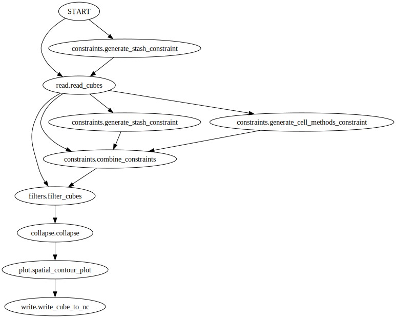
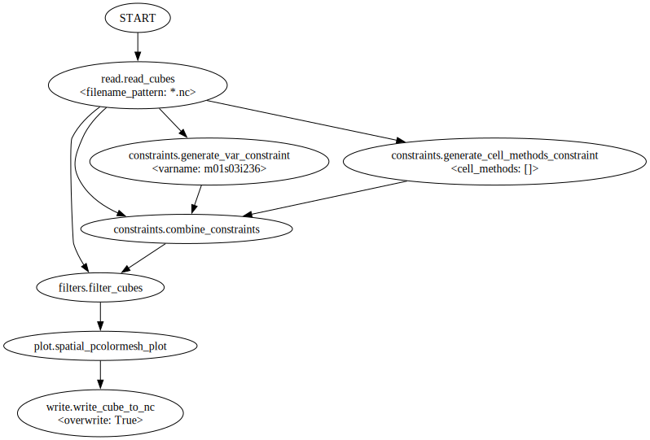

Visualising a recipe graphically
================================

.. Tutorial on cset graph and introduction to the recipe format.

In this tutorial we will investigate what is going on inside of a recipe, and
visualise the *operators* inside.

As in the previous tutorial we can download this linked example recipe file:
:download:`air_temperature_spatial_plot.yaml`

We will now visualise the steps inside the recipe using the ``cset graph``
command.

.. code-block:: bash

    cset graph -r air_temperature_spatial_plot.yaml

This should open an image of a visualisation of the recipe. Each node is a step,
or an *operator*, which does a single processing task. You can see that later
operators depend on previous ones, and this relationship can be as complicated
as needed.

To see more detail about each individual operator running we can use the
``--details`` flag. This shows the configuration of each operator in the recipe.

.. code-block:: bash

    cset graph --details -r air_temperature_spatial_plot.yaml

Now we can see the structure of the recipe graphically, we can delve into what
each operator is doing. The ellipses represent the operators, and the arrows
between them show where they pass their output to the next operators.

The first operator in the recipe is ``read.read_cubes``, which loads the data
cubes from a file into a CubeList, which it passes onto the next step.

This operators-running-operators behaviour is further used in the next step,
where the read CubeList is filtered down to a single air temperature cube. There
are two constraints used here, the variable's STASH code, and the cell methods.
These are combined into a single constraint by the
``constraints.combine_constraints`` operator before being used by the
``filters.filter_cubes`` operator.

Afterwards the cube passes to the ``plot.spatial_contour_plot`` and
``write.write_cube_to_nc`` operators to be plotted and saved.

You now know how to visualise a recipe, and a little about the operators it is
made up of. In :doc:`the next tutorial <create-first-recipe>` you will learn to
make your own recipe.
