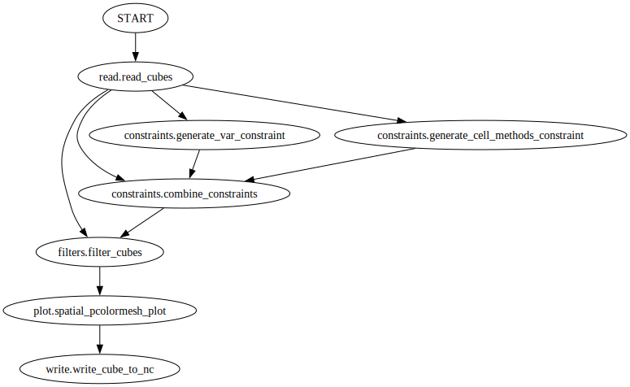

Visualising a recipe graphically
================================

.. Tutorial on cset graph and introduction to the recipe format.

In this tutorial we will investigate what is going on inside of a recipe, and
visualise the *operators* inside.

As in the previous tutorial use the ``cset cookbook`` command to find the "Mean
Air Temperature Spatial Plot" recipe.

We will now visualise the steps inside the recipe using the ``cset graph``
command.

.. code-block:: bash

    cset graph recipes/mean-air-temp-spacial-plot.yaml

This should open an image of a visualisation of the recipe. Each node is a step,
or an *operator*, which does a single processing task. You can see that later
operators depend on previous ones, and this relationship can be as complicated
as needed.

To see more detail about each individual operator running we can use the
``--details`` flag. This shows the configuration of each operator in the recipe.

.. code-block:: bash

    cset graph --details recipes/mean-air-temp-spacial-plot.yaml

Now we can see the structure of the recipe we can delve into what each operator
is doing. The ellipses are the operators, and the arrows between them show where
they pass their output to the next operators.

The first operator in the recipe is ``read.read_cubes``, however it
takes a constraint on a STASH code, which is itself created by another operator,
``constraints.generate_stash_constraint``.

This operators-running-operators behaviour is further used in the next step,
where the read CubeList is filtered down to a single air temperature cube. There
are two constraints used here, the STASH code, and the cell methods. These are
combined into a single constraint by the ``constraints.combine_constraints``
operator before being used by the ``filters.filter_cubes`` operator.

Afterwards the cube has its time dimension meaned by the ``collapse.collapse``
operator, so it becomes two-dimensional. Then it passes to the
``plot.spacial_contour_plot`` and ``write.write_cube_to_nc`` operators to be
plotted and saved.

You now know how to visualise a recipe, and a little about the operators it is
made up of. In the next tutorial you will learn to make your own.
