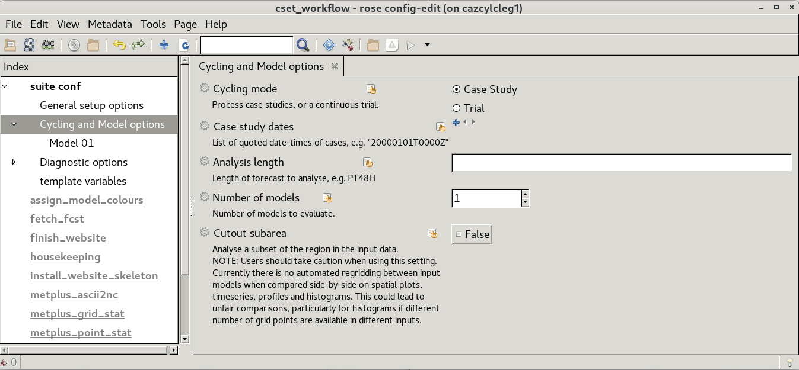

Configure the workflow
======================

Before running the CSET workflow, the workflow configuration needs to be edited
to add relevant task details.

Start by making a copy of the ``rose-suite.conf.example`` file called ``rose-suite.conf``.

This needs further job-specific changes, which are done using `rose edit`_, a GUI configuration
tool. Within rose edit work through each section under the "suite conf" tab in turn and
update required config options. Each setting has a description and help text which can be
used as a primary source of documentation when updating options.

.. code-block:: bash

    # Copy the example configuration.
    cp rose-suite.conf.example rose-suite.conf
    # Edit rose-suite.conf with the rose edit GUI.
    rose edit &

* The **General setup options** section contains settings for controlling how
  CSET integrates with your compute environment. This includes setting a site
  profile and activating modules.
  This section also includes whole-workflow configuration items including required
  level of logging and housekeeping, setting a path to override the default variable
  colorbar settings and set web paths for CSET outputs.

.. image:: rose-edit.png
    :alt: rose edit GUI, showing the environment setup options.

* The **Cycling and Model options** section contains settings for the input
  data. Here you specify the mode of cycling for evaluation tasks (over "case
  study" periods or a "trial" period of repeating forecasts), and the number of
  inputs (typically models) to evaluate.
  For each model up to the number required, a model-specific tab is available
  in which to set a model name and paths to model data.

* The **Diagnostic options** section contains settings for enabling the various
  :term:`diagnostics <diagnostic>` included with CSET. Panels are provided to control
  options for standard plots as required of "Surface (2D) fields", "Pressure level fields"
  and "Model level fields". Section include editable items to list requested diagnostic variables
  and processing methods. Options are provided to enable or disable which plot types are required.
  Additional options may also be activated after enabling particular GUI settings.

  Additional panels are provided for settings associated
  with more bespoke "Process-based" and "Verification" recipe methods.

  Further details are provided in the :doc:`worked example <run_full_cylc_workflow>`.

.. image:: rose-edit-diagnostics.png
    :alt: rose edit GUI, showing an example of diagnostic setup options.

Help text for each variable can be viewed by clicking on the variable's name.
Once you have finished updating CSET settings you can save the GUI (down arrow symbol) or (File -> Save)
and close rose edit.

Experienced CSET users, familiar with settings, can also choose to update ``rose-suite.conf`` using a
command-line editor, but for general use the rose GUI is recommended.

.. _rose edit: https://metomi.github.io/rose/doc/html/api/command-reference.html#rose-config-edit
