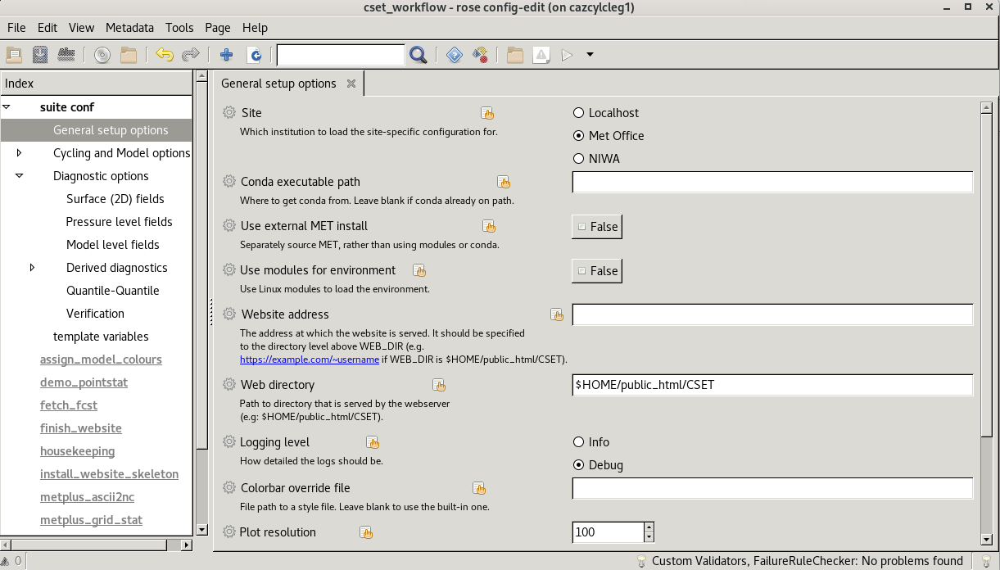

Run the workflow
================

To run the workflow we need to configure it.

You will then need to edit the configuration to set up your job. Start by making
a copy of the ``rose-suite.conf.example`` file called ``rose-suite.conf``. This
needs further amendments, which are done using `rose edit`_, a GUI configuration
tool. Within rose edit go through the sections under "suite conf" and fill in
the config.

.. code-block:: bash

    # Copy the example configuration.
    cp rose-suite.conf.example rose-suite.conf
    # Edit rose-suite.conf with the rose edit GUI.
    rose edit &

* The **General setup options** section contains settings for controlling how
  CSET integrates with your compute environment and whole-workflow configuration
  for things like logging and housekeeping. This includes things like activating
  modules, and choosing a site profile.

* The **Cycling and Model options** section contains settings for the input
  data. Here you need to setup how you want to cycle (over case studies or a
  trial period), how many models you want, and where to find the data for them.

* The **Diagnostic options** section contains settings for enabling the various
  :term:`diagnostics <diagnostic>` included with CSET. The diagnostics are split
  into science areas. Some general diagnostics will have a list in their section
  for setting which model fields to process. Diagnostics may also take
  additional options after being enabled.

Help text for each variable can be viewed by clicking on the variable's name.
Once you have configured CSET you can save and close rose edit.

To run the workflow, use ``cylc vip``. You can view the job's progress with the
cylc GUI, accessible with the command ``cylc gui``.

.. code-block:: bash

    # Run workflow from the current working directory.
    cylc vip .
    # Monitor workflow progress.
    cylc gui

Once CSET has finished running you will receive an email containing a link to
the output page.

.. _rose edit: https://metomi.github.io/rose/doc/html/api/command-reference.html#rose-config-edit
