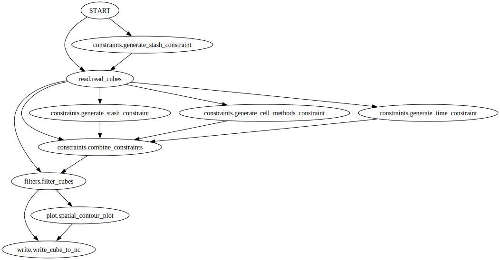

Usage Guide
===========

.. attention::

    🚧 Section under construction. 🚧

.. toctree::
    :maxdepth: 2

    operator-recipes

Installation
------------

The recommended way to install CSET is via conda. It is packaged on
`conda-forge`_ and can be installed with a simple ``conda install -c conda-forge
cset``.

If you instead want to run a development version that has yet to be released,
the easiest way is via an editable install. You can learn how to do this in the
:ref:`working_practices_getting_started` section of the
:doc:`../working-practices/index`.

.. _conda-forge: https://anaconda.org/conda-forge/cset

Usage
-----

cset operators
~~~~~~~~~~~~~~

Used to run a recipe on some data. The recipe, input file, and a path to an
output file must be provided. Additional help is available with the ``--help``
option. The recipe format is described on the :doc:`operator-recipes` page. If
recipe_file is omitted from the command line, the recipe will be read from the
``CSET_RECIPE`` environment variable instead. This environment variable should
contain the YAML text that you want executed.

.. code-block:: text

    usage: cset operators [-h] input_file output_file [recipe_file]

    positional arguments:
    input_file   input file to read
    output_file  output file to write
    recipe_file  recipe file to execute

    options:
    -h, --help     show this help message and exit
    -v, --verbose  increase output verbosity, may be specified multiple times

cset graph
~~~~~~~~~~

Visualise a recipe. This renders a graph representing the recipe, and saves it
to a temporary file, which is automatically opened. If the ``--detailed`` option
is specified it also includes operator arguments in the output, so you can see
exactly what ran.

.. code-block:: text

    usage: cset graph [-h] [-o [OUTPUT_PATH]] [-d] [recipe]

    positional arguments:
    recipe                recipe file to read. If omitted reads from CSET_RECIPE environment variable

    options:
    -h, --help            show this help message and exit
    -o [OUTPUT_PATH], --output_path [OUTPUT_PATH]
                            file in which to save the graph image, otherwise uses a temporary file. When specified the file is not automatically opened
    -d, --detailed        include operator arguments in output
