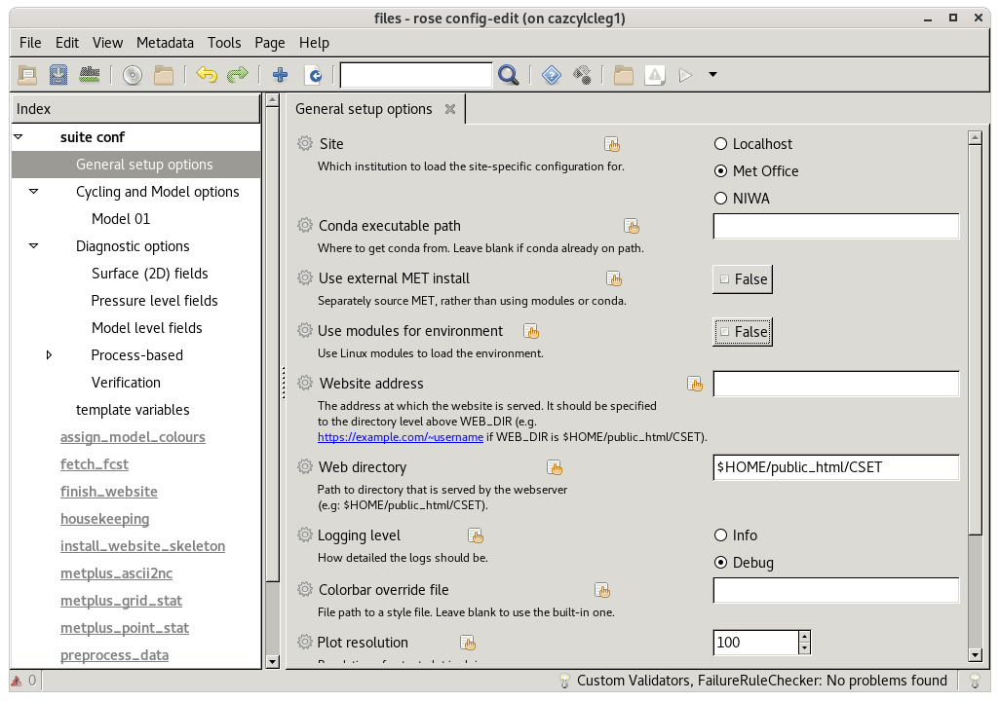

Install and run the CSET workflow
=================================

CSET is typically run through a `cylc workflow`_. The first thing you will need
to do is download the CSET workflow. The easiest way to do that is via the
`Releases page on GitHub`_, or you can clone the repository. Once downloaded the
tarball or zip can be unpacked to a location of your choosing.

CSET uses **cylc 8**, so you must ensure that is the version of cylc configured
for usage. For the Met Office installation this involves setting an environment
variable before running cylc with the following commands:

.. code-block:: bash

   export CYLC_VERSION=8
   cylc --version  # Check version starts in 8

The workflow lives within the ``cset-workflow`` directory, and all the following
commands assume you are within it.

.. code-block:: bash

  # From within your CSET repository, change into the workflow directory.
  cd cset-workflow

First up, if you are at a specific site, you need to install the site specific
configuration. This is done by running the ``install_restricted_files.sh``
script. In most cases you will want to omit the options, and use the defaults.

.. code-block:: bash

  ./install_restricted_files.sh [-b branch] [-R repository]

You will then need to edit the configuration to set up your job. Start by making
a copy of the ``rose-suite.conf.example`` file called ``rose-suite.conf``. This
needs further amendments, which are done using `rose edit`_, a GUI configuration
tool. Within rose edit go through the sections under "suite conf" and fill in
the config.

.. code-block:: bash

    # Copy the example configuration.
    cp rose-suite.conf.example rose-suite.conf
    # Edit rose-suite.conf with the rose edit GUI.
    rose edit &

* The Data and Cycling section contains settings for the input data, and the
  workflow cycling controls.

* The Diagnostic section contains settings for enabling the various diagnostics
  included with CSET. Some general diagnostics will take from a list of variable
  names or STASH codes, and operate on all of them.

* The Environment section contains settings for controlling how CSET integrates
  with your compute environment. This includes things like activating modules,
  and choosing a site profile.

* The General section contains whole-workflow configuration for things like
  logging and housekeeping.

Help for each variable can be viewed by clicking on the variable's name. Once
you have configured CSET you can save and close rose edit.

To run the workflow, use ``cylc vip .``. This submits the workflow to a cylc
scheduler. You can view the job's progress with the cylc GUI, accessible with
the command ``cylc gui``.

.. code-block:: bash

    # Run workflow
    cylc vip .
    # View workflow progress and don't use & at the end to enable
    # interactive mode. Ideally run the command in a separate terminal
    # that you can minimise.
    cylc gui

Once CSET has finished running you will receive an email containing a link to
the output page.

.. _cylc workflow: https://cylc.github.io/
.. _Releases page on GitHub: https://github.com/MetOffice/CSET/releases
.. _rose edit: https://metomi.github.io/rose/doc/html/api/command-reference.html#rose-config-edit
