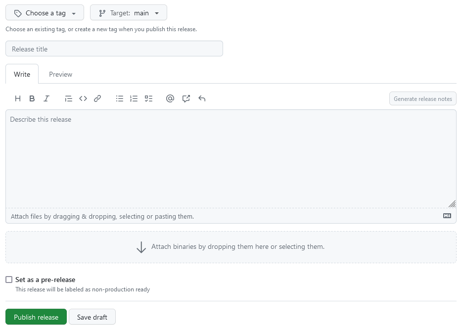

Release Management
==================

This will be some way off for now, but it is useful to have a policy/documented
process for making a release. Making stable releases is important as it gives
everyone something to rally around, whether  developers wanting to get in a
certain feature, or users wanting to find out what has changed.

Scientists like having stable versions to be able to finish their paper with, or
otherwise do their work without things changing.

A release manager will put the release together. Most work for the release
manager is integrating the various pull requests into the mainline. A lot of
work also goes into testing, especially functional testing, where output of the
known version is compared to known good output. A lot of work also goes into
communicating with everyone, such as contributors and changelogs for end users.

For making a release a branch is created with push protection that is
effectively frozen. The relevant commit is also tagged with the release number.
Ideally releases should be mostly automated, as that helps prevent accidents
(like publishing a broken build) happening.

Part of this will be considering our versioning strategy. I'm leaning towards
`CalVer <https://calver.org/>`_.

Backwards Compatibility Policy
------------------------------

As soon as we have users for CSET maintaining a certain level of backwards
compatibility becomes important, as they will want their use of CSET to continue
to work in future. As such it is useful to define a backwards compatibility
policy that sets expectations about the way backwards incompatible (AKA
"breaking") changes are made.

Some things to consider:

* How quickly backwards incompatible changes can be made.
* How long depreciation periods should be for different sizes of change.
* How the changes will be communicated with users.
* Guidance on avoiding making backwards incompatible changes where possible.

Making a Release
----------------

Making a release is mostly automated. The only thing that needs to be done in
the code is to ensure that the version number in ``pyproject.toml`` has been
incremented since the last release.

To create a release you should use the GitHub web UI. Go to the "Releases" page,
and press "Create a new release".

On this page you will need to add several things.

* A human readable release title, which should include the version number.
* The target branch to create the release from. (This might be ``main`` most of
  the time.)
* A tag, which should be the version number prefixed with the letter ``v``. For
  example version 1.2.3 should have the tag ``v1.2.3``.
* A description of the changes in the release. Pressing the "Generate release
  notes" button will include the titles of all merged pull requests, which is a
  good starting point. It is especially important to highlight any changes that
  might break backwards compatibility.

Once that is all written you simply need to press "Publish release". A release
will be automatically made, and the package will be pushed to PyPI and beyond.
